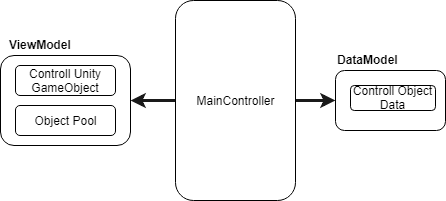
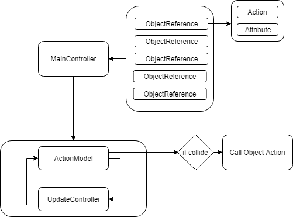

炸彈超人
===================

### 1.遊戲畫面

#### 遊戲畫面

### 2.架構:

* MVC架構:

* 程式流程:

### 3.地圖系統:
* 依Node為單位作為物件所在的依據，所有的物件都是在Node之間做移動。

### 3.碰撞偵測:

* 我這次結合了Node跟座標的碰撞。在物件移動時，選定某一個範圍的Node做座標的碰撞，(EX : 往上移動，就把左上、上、右上的Node加進要檢查的List，在用這個物件跟這些點上的物件做座標上的碰撞)。這樣做可以增加一定的自由度跟精確度，卻又不用跟整張地圖的物件做計算。

### 4.設計模式:

* 1.`物件池(ObjectPool)`:基本上我場面上所有的遊戲物件都是同一個物件所產生，只是裡面的參數不同，所以當要回收再利用時，只需要改變其中的值就可以。
* 2.`享元(Flyweight Pattern)`:我把`Controller`(控制)、`Action`(所有事件的介面跟實作)、`MoveEvent`(決定要播的動畫跟參數)，Function化，讓他一開始就產生實體，而物件只需要把自己當作參數帶入這兩個Model的Function內，就可得到相對應的效果。

### 5.介面跟邏輯

* 我這次的Action把介面跟邏輯跟開來
Action的Function有

      1.InitAction(MapObject _MapOjbect)(創造物件時觸發)
      2.CollideWithObject(MapObject _MapOjbect)(碰撞到物件時觸發)
      3.EnterNewNode(MapObject _MapOjbect)(進入新的Node的時候觸發)
      4.DieEvent(MapObject _MapOjbect)(物件Destroy時觸發)
      5.ExceedBorder(MapObject _MapOjbect)(物件超出地圖範圍時觸發)
      6.GenerateEffect(MapObject _MapOjbect)(更新角色裝備時觸發)

而物件就是去實作這些Function，讓我們新增物件時不需要更改主程式的程式碼，只需要多創一個Class繼承Action，並實作他的Function即可。

### 6.Layer分層

* 因為Unity Canvas的UI物件顯示的前後順序(也就是一般Z-order)，跟物件在Canvas裡面的排序有關(排在最下面的顯示在最上層)，而我上次小精靈並沒有考慮到這一點，因此會發生道具遮住小精靈的情況。因此我這次在物件的屬性裡面加入了Z-Order的參數，代表要顯示在第幾層，越高就是顯示在越上層，再創造物件時，先創造該Z-Order的Layer物件，再將物件放入Layer中，

### 7.分離軸演算法(SAT)

* 由於我的炸彈爆炸是用創四個物件去做四個方向的移動，然後在EnterNewNode時，在前一個Node創造一個火焰，並在撞到障礙物時停下來，由於要有爆炸的感覺，移動的物件必須要很快，因此有可能會發生:

如果只是用當下的位子做判斷的話，是會判斷成沒有碰撞的，因此我把移動過的地方都加入判斷，只要在路徑上有碰撞到的都算碰撞。

而平行四邊形跟四邊形的判斷交疊我是用分離軸演算法，分離軸詳細資料可參考[分離軸演算法](http://www.itread01.com/articles/1486273109.html)。

