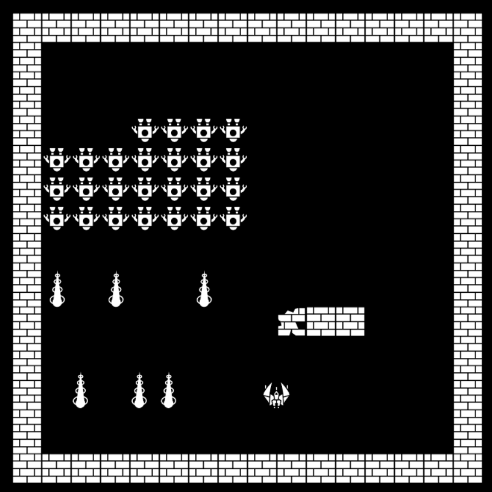

小蜜蜂
===================

### 1.遊戲畫面

### 2.架構:

### 3.碰撞偵測:

&nbsp;&nbsp;&nbsp;&nbsp;&nbsp;&nbsp;基本上是依座標做矩形碰撞，如果有重疊即碰撞。

### 4.設計模式:

* 1.`物件池(ObjectPool)`:基本上我場面上所有的遊戲物件都是同一個物件所產生，只是裡面的參數不同，所以當要回收再利用時，只需要改變其中的值就可以。
* 2.`享元(Flyweight Pattern)`:我把`Controller`(控制)、`Action`(碰撞所發生的事件)，Function化，讓他一開始就產生實體，而物件只需要把自己當作參數帶入這兩個Model的Function內，就可得到相對應的效果。