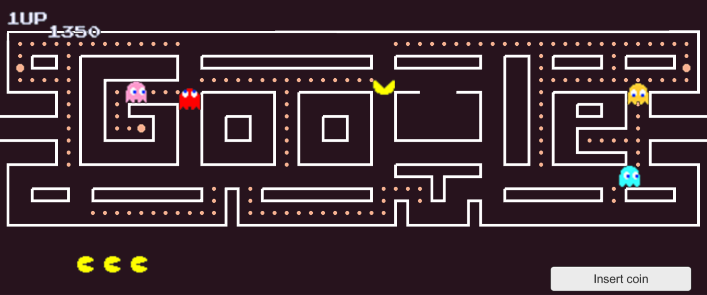
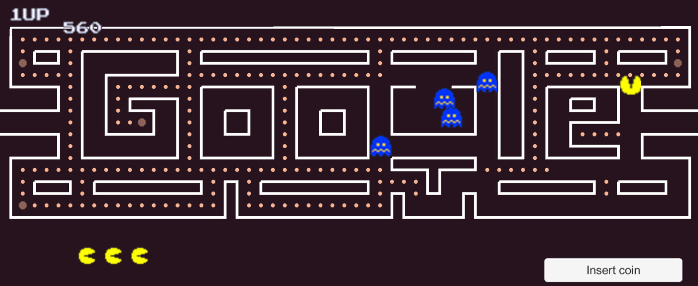
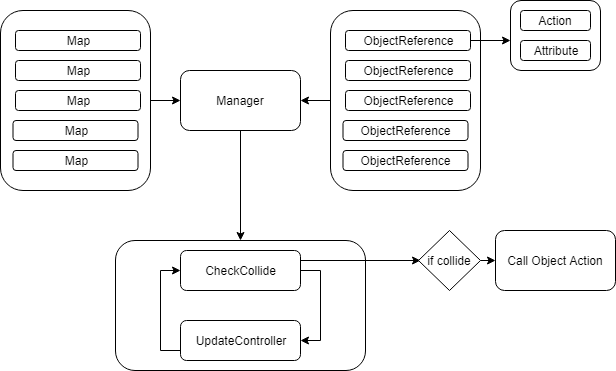
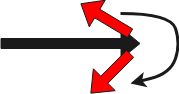
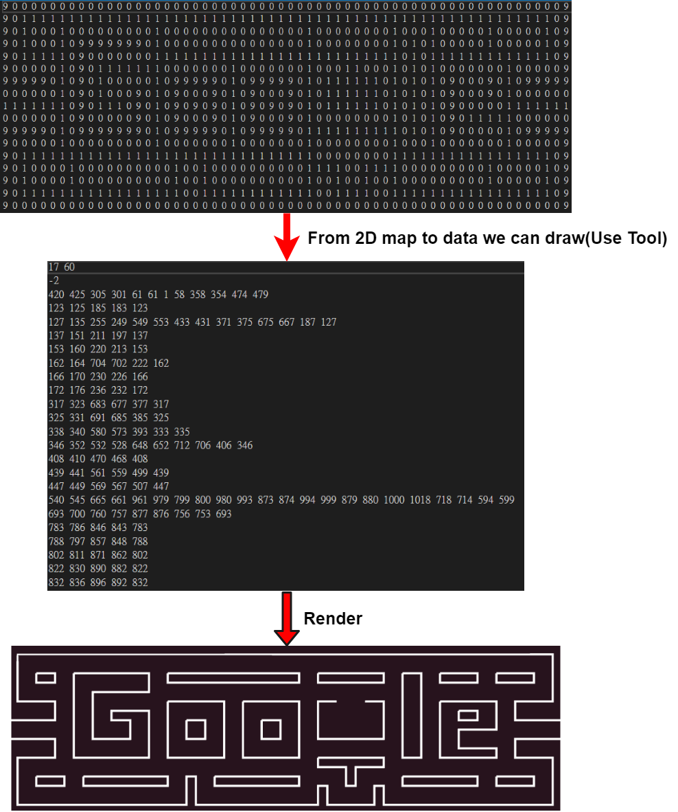

小精靈
===================

### 1.遊戲畫面

### 2.架構:

### 3.地圖系統:
* 依Node為單位作為物件所在的依據，所有的物件都是在Node之間做移動。
* 在遊戲開始前，把二維陣列的資料用我寫的Unity工具轉換成我們所使用的Node表示法(Ex : 0 1 2 3 4 代表編號0的Node的上下左右分別為編號1 2 3 4的Node)，然後在開始遊戲時把每一關相對應的txt檔匯入成關卡資訊。

### 3.碰撞偵測:

* 在同一個Node上的物件即為有碰撞。
* 會動的物件在到達新的Node時，偵測自己Node的碰撞，因此不需要每個物件都對場面上所有的物件做判斷，只需要對一個Node上的物件做判斷即可，而且也可以省下判斷四邊形有無重疊的計算。

### 4.設計模式:

* 1.`物件池(ObjectPool)`:基本上我場面上所有的遊戲物件都是同一個物件所產生，只是裡面的參數不同，所以當要回收再利用時，只需要改變其中的值就可以。
* 2.`享元(Flyweight Pattern)`:我把`Controller`(控制)、`Action`(碰撞所發生的事件)，Function化，讓他一開始就產生實體，而物件只需要把自己當作參數帶入這兩個Model的Function內，就可得到相對應的效果。

### 5.繪製地圖

* 遊戲中牆壁所在的地圖我是用程式對二為陣列做計算後，把相連的點放入LineRenderer做顯示。
* 我的相連最外圍點的演算法:
1.牆壁資料為0,1的二維陣列，0即為有牆壁，1則無
2.從二維陣列最上面的Row開始掃描，當掃描到0時，對該方向向量做順時針的偵測，找到下一個點後Push到List，並把該點改成其他值，然後做遞迴直到找不到點。

* 範例:

